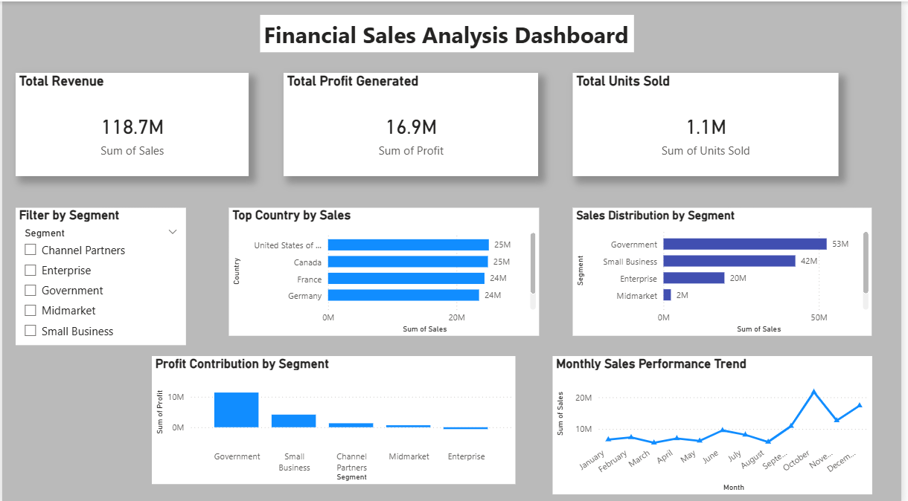

# Financials-Sales-Analysis-Dashboard(Power BI)

Project Overview
This project presents an interactive Financial Sales Analysis Dashboard built using Power BI.
The objective of this dashboard is to analyze sales performance, profit contribution, and trends across different countries and business segments.
The dashboard helps transform raw financial data into meaningful business insights that support better decision-making.

---

Tools & Technologies Used
- Power BI
- Power Query (Data Cleaning)
- DAX (Basic Calculations)

---

Dataset
The dashboard is built using the Financial Sample Dataset provided in Power BI.
The dataset contains information about:
- Sales
- Profit
- Units Sold
- Country
- Segment
- Product
- Date

---

Data Preparation
Data was cleaned and prepared using Power Query before creating the dashboard.
Steps included:
- Checking column formats
- Verifying data consistency
- Preparing fields for visualization

---

Dashboard Features
This dashboard includes the following visualizations:
- KPI Cards
  - Total Sales
  - Total Profit
  - Total Units Sold

- Sales by Country
  - Comparison of revenue generated across different countries

- Sales by Segment
   - Understanding which business segment contributes the most to revenue

- Profit by Segment
  - Identifying the most profitable segments

- Sales Trend Over Time
  - Monthly trend analysis to observe sales patterns

- Segment Filter (Slicer)
  - Interactive filtering for better data exploration

---

Key Insights
From the analysis we can observe:
- Some countries generate significantly higher revenue than others.
- Government and Enterprise segments contribute a large portion of total sales.
- Sales trends vary across months, indicating possible seasonal patterns.

---

Dashboard Preview
 

---

Project File
The Power BI (.pbix) file is included in this repository so that users can explore the dashboard and understand how the visuals were built.

---

Author
Tanuja
Aspiring Data Analyst | Learning Data Analytics & Building Projects
